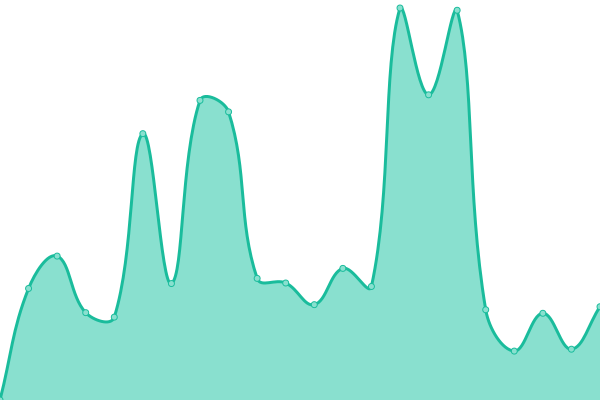

# [📈 Live Status](https://status.butadora.com): <!--live status--> **🟧 Partial outage**

This repository contains the open-source uptime monitor and status page for [butadora](https://butadora.com/), powered by [Upptime](https://github.com/upptime/upptime).

With [Upptime](https://upptime.js.org), you can get your own unlimited and free uptime monitor and status page, powered entirely by a GitHub repository. We use [Issues](https://github.com/butadora3/upptime/issues) as incident reports, [Actions](https://github.com/butadora3/upptime/actions) as uptime monitors, and [Pages](https://status.butadora.com) for the status page.

<!--start: status pages-->
<!-- This summary is generated by Upptime (https://github.com/upptime/upptime) -->
<!-- Do not edit this manually, your changes will be overwritten -->
<!-- prettier-ignore -->
| URL | Status | History | Response Time | Uptime |
| --- | ------ | ------- | ------------- | ------ |
|  [butadora pgae](https://butadora.com) | アップ | [butadora-pgae.yml](https://github.com/butadora3/upptime/commits/HEAD/history/butadora-pgae.yml) | 

 448ms
     
 | 

<a href="https://status.butadora.com/history/butadora-pgae">99.47%</a>
    

|  [oishiipp page](https://01c.cloud) | アップ | [oishiipp-page.yml](https://github.com/butadora3/upptime/commits/HEAD/history/oishiipp-page.yml) | 

 420ms
     
 | 

<a href="https://status.butadora.com/history/oishiipp-page">99.47%</a>
    

|  [oishiipp dogrep page](https://dogrep.01c.cloud) | ダウン | [oishiipp-dogrep-page.yml](https://github.com/butadora3/upptime/commits/HEAD/history/oishiipp-dogrep-page.yml) | 

 0ms
     
 | 

<a href="https://status.butadora.com/history/oishiipp-dogrep-page">0.00%</a>
    

|  [take01x.okinawa](https://www.take01x.okinawa) | アップ | [take01x-okinawa.yml](https://github.com/butadora3/upptime/commits/HEAD/history/take01x-okinawa.yml) | 

 2565ms
     
 | 

<a href="https://status.butadora.com/history/take01x-okinawa">66.50%</a>
    

<!--end: status pages-->

[**Visit our status website →**](https://status.butadora.com)

## 📄 License

- Powered by: [Upptime](https://github.com/upptime/upptime)
- Code: [MIT](./LICENSE) © [butadora](https://butadora.com/)
- Data in the `./history` directory: [Open Database License](https://opendatacommons.org/licenses/odbl/1-0/)
